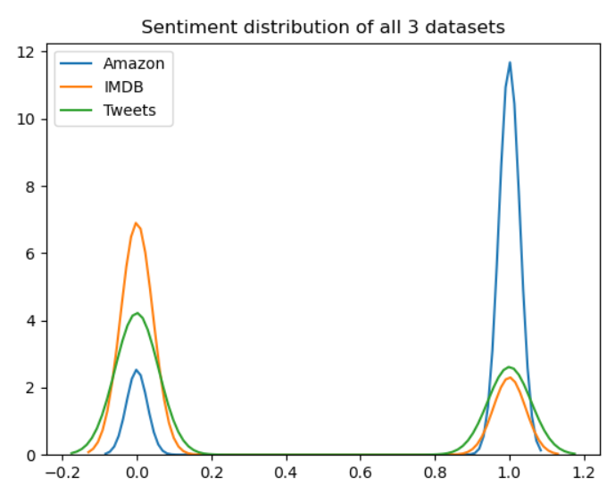

Sentiment Analysis
===================

Synopsis
--------

Develop algorithms that process labelled datasets to learn the sentiments present within and then
accurately predict the sentiment of similar data.

Approach
--------

I've implemented the project on 3 separate datasets:
1) Twitter
 - [1](https://data.world/crowdflower/sentiment-analysis-in-text)
2) IMDB
 - [1](https://www.kaggle.com/utathya/imdb-review-dataset)
 - [2](http://ai.stanford.edu/~amaas/data/sentiment/)
3) Amazon
 - [1](https://www.kaggle.com/bittlingmayer/amazonreviews)
 - [2](http://deepyeti.ucsd.edu/jianmo/amazon/index.html)
 
I’ve used NLTK and Regular Expression libraries for text cleaning in each of the five methods I’ve
implemented. I also tried using un-processed data in the methods 2-5 but it resulted in a minute
difference in test accuracy (-0.2%) so I didn’t include those in my final solutions.

Methods:
1) Multinomial Naïve Bayes based on tfidf using Sklearn
2) LSTM with relu and sigmoid activation functions using Keras
3) Bi-grams using Pytorch
4) 2D Bidirectional RNN using Pytorch
5) CNN layers of multi-dimensional filters using Pytorch

Assumptions
-----------

1) The data is labelled correctly
2) Extremely short tweets/reviews like a single word or emoji can be used for training and
subsequent prediction even though they might negatively affect results.

Charts
------

- Logic Flow

- Dataset Size

- Sentiment Distribution

Outcome
-------

 - Testing Accuracy
   ----------------

|   | IMDB                               | IMDB   | Tweets | Amazon |
|---|------------------------------------|--------|--------|--------|
|   | Multinomial Naïve Bayes - Sklearn  | 74.98% | 71.31% | 88.25% |
|   | LSTM - Keras                       | 74.86% | 71.10% | 90.43% |
|   | Bigrams - Pytorch                  | 74.06% | 72.89% | 88.86% |
|   | Bidirectional RNN - Pytorch        | 75.04% | 73.14% | 90.04% |
|   | CNN - Pytorch                      | 75.42% | 73.52% | 90.50% |

On comparing the results of the Amazon dataset with the others, it is evident that larger the amount
of available data for training, higher the accuracy. But this could also be due to overfitting even
though precautions were taken to avoid it.
Among the 5 methods used, the method of passing the vectors through multi-dimensional filters of
CNN layers achieved the highest accuracy across all three datasets.

Exceptions Considered
---------------------

The twitter dataset doesn’t allow the algorithms to achieve high accuracy due to the use of slangs,
different short forms for the same word and high amounts of sarcasm. I’ve included the dataset
without removing such tweets for training the model but each such tweet is an exception in its own
different way.
Also, the IMDB and Twitter datasets have a larger amount of negative sentiments which can skew the 
results.

Scope for Enhancement
---------------------

Since it is clear that a larger amount of data for training results in higher accuracy, the algorithms on
the IMDB and Tweets can be further enhanced to attain much higher accuracy by training them with
more similar data.
I’ve included alternate datasets as well for this purpose.

